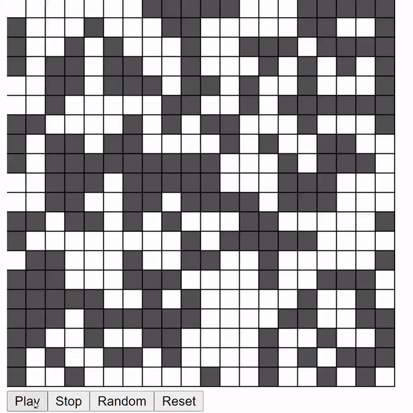

# Game-of-life-with-p5.js-library

This is a simple implementation of **Conway's game of life** in javascript using *p5 library*.

# Want to just play the game, click [PLAY](https://knightfury16.github.io/Game-of-life-with-p5.js-library/src)

## General description and rules

**The game of life**, also known simply as **Life**, is a cellular automaton devised by the British mathematician Jhon Conway in 1970. To get a more description from the man himself watch this [video](https://www.youtube.com/watch?v=R9Plq-D1gEk).

It is a zero-player game, meaning that its evolution is determined by its initial state, requiring no further input. One interacts with the Game of Life by creating an initial configuration and observing how it evolves. It is a Turing complete and can simulate a universal constructor or any other Turing machine.

In its standard format, the Game of Life unfolds on an *infinite two-dimensional grid* composed of cells each of which is either **‘on/alive’** or **‘off/dead’**. The game takes place in discrete time, with the state of each cell at time **_t_** determined by its own state and the states of its **eight immediate neighbours** at **_t-1_**, according to the following simple rules:

- Any **‘on’** cell (at time **_t-1_**) with **fewer than two** **‘on’ neighbours** (at **_t -1_**) transitions to an **‘off’** state at time **_t_**.
- Any **‘on’** cell (**_t -1_**) with **two or three ‘on’ neighbours** (**_t -1_**) remains **‘on’** at time **_t_**.
- Any **‘on’** cell (**_t -1_**) with **more than three ‘on’ neighbours** (**_t -1_**) transitions to an **‘off’** state at time **_t_**.
- Any **‘off’** cell (**_t -1_**) with **exactly three ‘on’ neighbours** (**_t -1_**) transitions to an **‘on’** state at time **_t_**.

To render the game click this **[link](https://knightfury16.github.io/Game-of-life-with-p5.js-library/src)**. Either draw the game initial configuration manually with the mouse or initialize randomly with the random seed button. And then click *play*.

